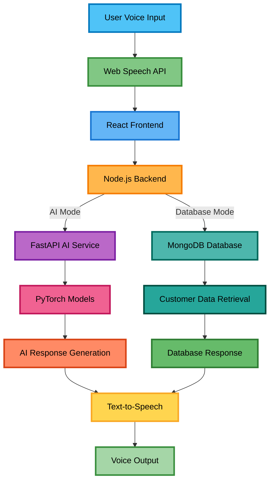

# 🧠 TRAVIS - AI-Powered Assistant for Visually Impaired Service Agents

<div align="center">

[](https://opensource.org/licenses/MIT)
[](https://python.org)
[](https://reactjs.org)
[](https://nodejs.org)

TRAVIS is a **voice-driven, AI-powered banking assistant** designed to empower visually impaired bank agents. It processes spoken queries, classifies them into relevant banking categories using a transformer model, and retrieves customer data when needed—providing an **accessible interface with voice and visual support**.

</div>

---

## 🚀 Key Features

### 🎙️ **Voice Interaction**
- **Speech-to-Text**: Uses **Web Speech API** for converting voice input into text.
- **Text-to-Speech (TTS)**: Provides voice responses for seamless communication.
- **Auto-Read Mode**: Toggleable feature to read responses aloud automatically.

### 🧠 **AI-Powered Query Handling**
- **Query Classification**: Uses a transformer-based model for accurate banking category identification.
- **Multi-Mode Response System**:
  - **Transformer Mode**: Generates dynamic responses based on a custom PyTorch model.
  - **Database Mode**: Fetches account-related details for queries requiring authentication.

### 🔁 **Banking Services Covered**
- 💰 **Balance Inquiry**
- 📄 **Account Statement**
- 📌 **KYC Status**
- 🏦 **Loan Approval & Status**

### 👤 **Agent & Admin Dashboard**
- **Agent Profile**: Accessible dashboard for visually impaired bank agents.
- **Admin Panel**: Allows management of customer accounts (*CRUD operations*).

### ♿ **Accessibility Enhancements**
- **Adjustable Font Sizes**
- **High-Contrast Dark Mode**
- **Voice Response Toggle for Optimal Usability**

---

## 🛠 Technology Stack

<div align="center">

| **Layer** | **Technology** |
|-----------|----------------|
| **Frontend** |   Web Speech API, TTS |
| **Backend** |   MongoDB |
| **AI Model** |    |
| **Database** |  |

</div>

---

## 📦 Installation & Setup

### 🚀 Quick Start

#### 1️⃣ Clone the Repository
```bash
git clone https://github.com/AmshudharReddy/TRAVIS.git
cd TRAVIS
```

#### 2️⃣ Frontend Setup
```bash
cd frontend
npm install
npm audit fix  # Fix any vulnerabilities
```

#### 3️⃣ Backend Setup
```bash
cd ../backend
npm install
```

#### 4️⃣ AI Services Setup
```bash
cd ../services
pip install -r requirements.txt
```

### 🐍 Python Dependencies
Create a `requirements.txt` file with the following dependencies:

```txt
fastapi==0.104.1
uvicorn[standard]==0.24.0
torch==2.1.0
scikit-learn==1.3.2
nltk==3.8.1
pickle5==0.0.12
transformers==4.35.0
numpy==1.24.3
pandas==2.0.3
```

#### 🔧 NLTK Setup
If you encounter issues with NLTK tokenizers:

```python
import nltk
nltk.download('punkt')
nltk.download('stopwords')
```

---

## ▶️ Running the Application

### 🖥️ Development Mode
Open **three separate terminals** and run:

<div align="center">

| **Service** | **Directory** | **Command** | **URL** |
| ----------- | ------------- | ----------- | ------- |
| 🎨 **Frontend** | `./frontend` | `npm start` | `http://localhost:3000` |
| 🔧 **Backend** | `./backend` | `node index.js` | `http://localhost:5000` |
| 🤖 **AI Services** | `./ai_services` | `python main.py` | `http://localhost:5001` |

</div>

---

## 🔌 API Endpoints

### 📥 **Request Example:**
```json
{
  "query": "What if I lost my cheque book?"
}
```

### 📤 **Response Examples:**

#### 1️⃣ **Encoder-only Transformer model:**
*Classifies input queries into relevant banking categories.*
```json
{
  "category": "top_up_by_cash_or_cheque"
}
```

#### 2️⃣ **Encoder-Decoder Transformer (Seq2Seq):**
*Generates a response for the given input query.*
```json
{
  "response": "if you lost your cheque deposit please provide the deposit date amount and method used i will review your account and investigate the issue"
}
```

### 🌐 **Translation Example:**

#### 3️⃣ **Encoder-Decoder Transformer (Seq2Seq):**
*Translates the generated response into the local language (Telugu).*
```json
{
  "translation": "మీరు మీ చెక్కును జమ చేయకపోతే దయచేసి డిపాజిట్ తేదీ మొత్తం మరియు ఉపయోగించిన పద్ధతిని అందించండి నేను మీ ఖాతాను సమీక్షిస్తాను మరియు సమస్యను పరిశీలిస్తాను"
}
```

---

## 🏗️ Architecture


---

## 📸 Screenshots

<div align="center">

### 🖥️ **Agent Dashboard UI**


### 💬 **Response Display UI**


### 🔄 **Input-Output Workflow**


### 🌙 **Dark Mode & Accessibility Features**


</div>

---
## 🛣️ Roadmap

### 🎯 Version 2.0 Goals

- [ ] **Multi-language Voice Support** - Additional regional languages
- [ ] **Advanced Analytics Dashboard** - Usage insights and reporting
- [ ] **Mobile Application** - Native iOS and Android apps
- [ ] **Biometric Authentication** - Voice pattern recognition
- [ ] **Real-time Notifications** - Account alerts and updates
- [ ] **Enhanced AI model accuracy**
- [ ] **Improved accessibility features**
- [ ] **Advanced security measures**
- [ ] **Performance optimizations**

---

## 🚨 Troubleshooting

### Common Issues

**Voice recognition not working?**
- Ensure microphone permissions are granted
- Check browser compatibility (Chrome/Edge recommended)
- Verify microphone hardware functionality

**AI service connection failed?**
- Confirm Python dependencies are installed
- Check if port 5001 is available
- Verify model files are present

**Database connection issues?**
- Ensure MongoDB is running
- Check connection string in `.env`
- Verify database permissions

---

## 📜 License
**MIT License** – See `LICENSE` file for details.

## 📌 Acknowledgements

We extend our gratitude to the following technologies and communities:

<div align="center">

| Technology | Purpose | Links |
|------------|---------|-------|
|  | Deep Learning Framework | [pytorch.org](https://pytorch.org) |
|  | Modern Python API Framework | [fastapi.tiangolo.com](https://fastapi.tiangolo.com) |
|  | Frontend Library | [reactjs.org](https://reactjs.org) |
|  | Document Database | [mongodb.com](https://mongodb.com) |
| **Web Speech API** | Browser Speech Recognition | [MDN Docs](https://developer.mozilla.org/en-US/docs/Web/API/Web_Speech_API) |
| **gTTS** | Google Text-to-Speech | [PyPI](https://pypi.org/project/gTTS/) |

</div>

## 🤝 Contributing

We appreciate contributions via pull requests. For major changes, please open an issue first so we can have a quick discussion about your plans.

---

## 🙋‍♂️ Author

<div align="center">

**Amshudhar A. & Team**  
*Building accessible, intelligent tools for real-world impact.*

[](https://github.com/AmshudharReddy)

</div>

---

<div align="center">

### 🌟 If TRAVIS helped you, please consider giving it a star!

[](https://github.com/AmshudharReddy/TRAVIS)

**Made with ❤️ for accessibility and inclusion**

</div>
